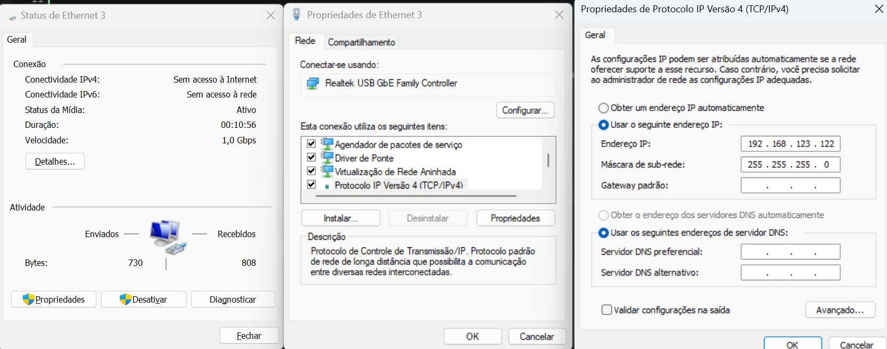

``` bash
pip install --upgrade pip setuptools wheel
```


Python sdk: https://github.com/unitreerobotics/unitree_sdk2_python


Have a look at the faq if you are getting an error with the `cyclonedds` https://github.com/unitreerobotics/unitree_sdk2_python#faq


## Connecting to the robot

After wiring it up you need to configure the pc's IPV4 address to be in the same subnet as the robot. The default IP address of the robot is `192.168.123.161`.

Go into the adapter then properties and set the IPV4 address to `192.168.123.122` where x is any number between 1 and 254 except 161. The subnet mask should be `255.255.255.0`.




To know what adapter you are using you can ping the robot


``` bash
ip route get 192.168.123.161
```


### Onboard computer

The onboard computer is running ubuntu and you can connect to it using ssh

``` bash
ssh unitree@192.168.123.18
```

Password: 123


## 360 cam

We are using the Ricoh Theta X camera.

If the stream is not working you can try downloading the drivers from the website https://support.ricoh360.com/faq/v-view-003